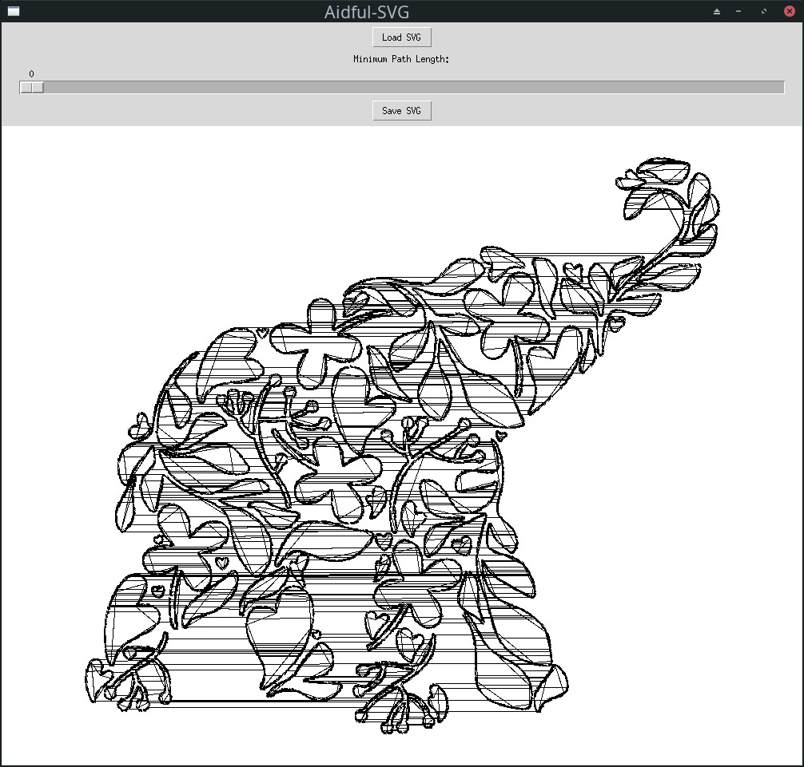
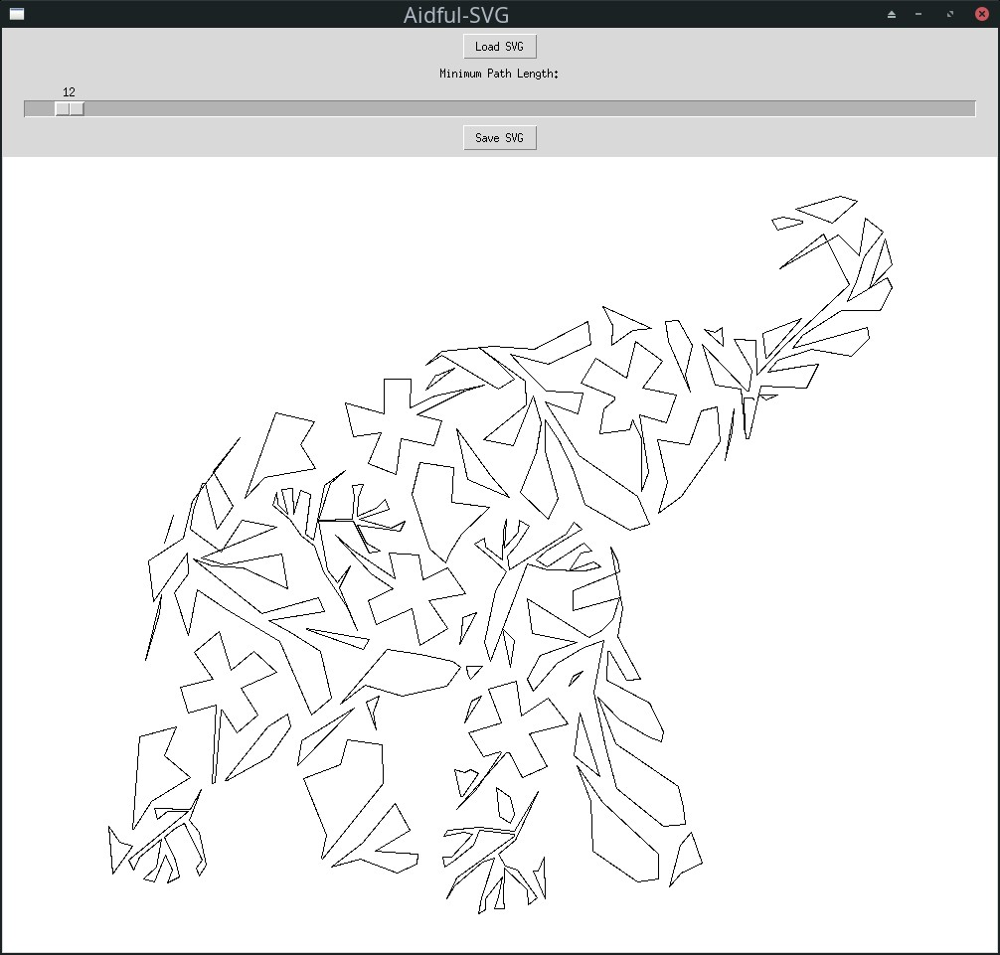

# Aidful-SVG

Aidful-SVG is a Python script that allows users to remove small paths from SVG files. This tool provides a simple graphical interface to load SVG files, preview changes, and save the modified SVG with small paths removed.

## Features

- Load SVG files
- Interactive slider to adjust the minimum path length
- Real-time preview of the modified SVG
- Save the resulting SVG with small paths removed

## Installation

1. Clone this repository:
   ```
   git clone https://github.com/yourusername/aidful-svg.git
   ```

2. Navigate to the project directory:
   ```
   cd aidful-svg
   ```

3. Install the required dependencies:
   ```
   pip install -r requirements.txt
   ```

## Usage

1. Run the script:
   ```
   python aidful-svg.py
   ```

2. Use the "Load SVG" button to select an SVG file.

3. Adjust the slider to set the minimum path length. Paths shorter than this value will be removed.

4. The preview will update in real-time as you adjust the slider.

5. When satisfied with the result, click the "Save SVG" button to save the modified SVG file.

## Example

Here's an example of the Aidful-SVG interface with an SVG file loaded that contains many small paths:



After adjusting the slider, you can see a preview of the SVG with smaller paths removed:



## How It Works

Aidful-SVG uses the following process to remove small paths:

1. Parses the input SVG file.
2. Calculates the length of each path in the SVG.
3. Removes paths shorter than the user-specified minimum length.
4. Generates a new SVG with the remaining paths.

## Dependencies

- Python 3.12
- svgpathtools
- tkinter

## Contributing

Contributions are welcome! Please feel free to submit a Pull Request.

## License

This project is licensed under the MIT License - see the [LICENSE](LICENSE) file for details.
